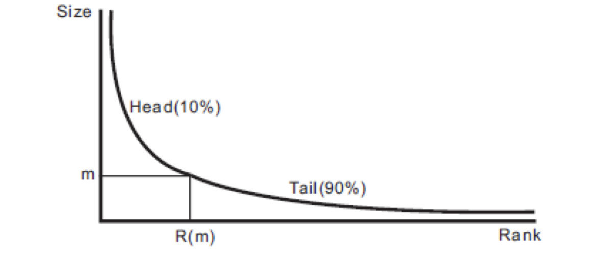

# Head/tail breaks approach

It is a technique to find groupings or hierarchy for data with a heavy-tailed distribution. The heavy-tailed distributions are heavily right skewed, with a minority of large values in the head and a majority of small values in the tail, commonly characterized by a power law, a lognormal or an exponential function.   

Here is some examples of these distributions: 

- Power law: $$y = Cx^{- \alpha}$$
- Pareto distribution: $$ Pr(x) = \alpha C^{\alpha}x^{-\alpha-1} $$
- Rank size function: $$y = C rank(x)^{- \alpha}$$
- Lognormal distribution
- Weibull
Log-Cauchy, also known as super-heavy tail distribution (Falk, Huesler, and Reiss (2011), p. 80, Fraga Alves, Haan, and Neves (2009))

Non heavy-tailed distributions

- Normal (non heavy-tailed)
- Truncated Normal (left-tailed)
- Uniform distribution

For example, a country’s population is often distributed in such a heavy-tailed manner, with a minority of people (e.g., 20 percent) in the countryside and the vast majority (e.g., 80 percent) in urban areas.

The common approaches of grouping values are dominated by a Gaussian way of thinking where they focus on high-frequency events. Let's reverse it by concentrating on low-frequency values because they tend to have high impact and contain more information than high-frequency events. The lowest frequency value is ranked number 1, the second-lowest frequency value is ranked number 2, and so on. It is called the rank-size distribution and initially used for word frequencies and city sizes.

head/tail-breaks partitions all of the data values around the mean into two parts and continues the process iteratively for the values (above the mean) in the head until the head part values are no longer heavy-tailed distributed.


please check [this paper](https://arxiv.org/ftp/arxiv/papers/1209/1209.2801.pdf) for more detail.

A naive approach is added, however, one can use this api
```python
!pip install pysal
import mapclassify as mc
htb = mc.HeadTailBreaks(X)
```